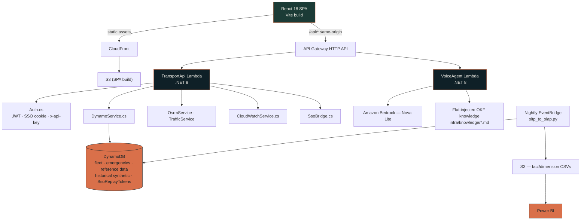
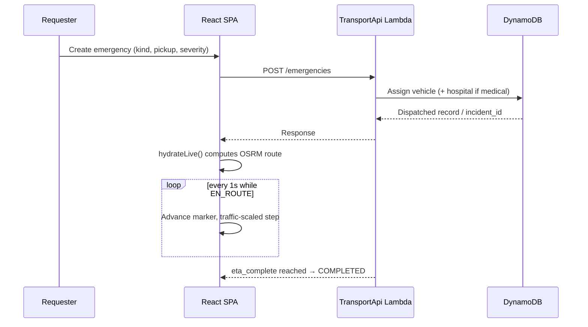
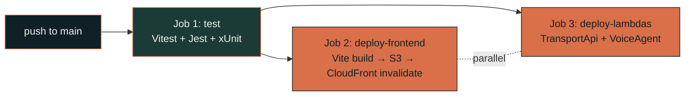

 

  

internal package name: <code>tata-fleet-command</code> · 191 tracked files · ~25,081 lines of source

 

## What this is

**JSD Emergency Services Management** is the dispatch console for Tata Steel's Jamshedpur township. One system coordinates three kinds of emergency response — **medical** (ambulance), **fire** (fire truck), and **blood** (courier runs between hospitals and blood banks) — from the moment a request comes in, through live map tracking, to completion.

It's not just a dashboard. It's a full operational stack: a self-service requester portal, a voice-driven intake agent, a policy-document ingestion agent, a nightly ETL pipeline feeding Power BI, and an AI Insights page built on the same historical data.

 

## Who uses it

Two roles, resolved from Cognito group membership — nobody logs in to *this app* directly.

<table>
<tr>
<th>Admin — the Console</th>
<th>User — the Portal</th>
</tr>
<tr>
<td valign="top">

Control-room dispatchers get the full console: Dashboard, Emergencies, Dispatch Board, Live Map, Fleet & Crews, Power BI, AI Insights, Infra Health.

</td>
<td valign="top">

Hospital / requester staff get a simplified portal to create and track their own requests — plus a **voice-call intake** option instead of typing.

</td>
</tr>
</table>

A third, unauthenticated surface exists purely for share links — `/track/:id` — reading one emergency's live position through a tokenized public endpoint, no login involved.

 

## System architecture

 

## Under the hood — the interesting decisions

This project has some genuinely thoughtful engineering tucked into it. A few worth calling out:

<b>Tokens live in memory, never in storage</b>

 

`src/auth.js` deliberately keeps SSO tokens in a module-scope JS variable — not `localStorage`, not `sessionStorage`. Why: anything sitting in web storage is readable by any injected script or storage-capable browser extension for as long as the tab lives. An in-memory variable has no such read API and vanishes on reload. The cost is a lost session on hard refresh — accepted, because the parent SSO portal keeps its own session and just bounces the user back through with a fresh token.

<b>Replay-proof SSO bridge</b>

 

The cookie-based SSO bridge doesn't trust JWT expiry alone — that only bounds *how long* a token is valid, not *how many times* it can be used. A DynamoDB conditional write (`attribute_not_exists(jti)`) against a dedicated replay-guard table enforces true single-use, with a 5-minute freshness window layered on top as defense-in-depth (widened from an original 30-second target once real portal-redirect latency measured 70–110 seconds).

<b>Client-computed routing, server-verified completion</b>

 

Route geometry is computed client-side against OSRM (filtering detours beyond 1.4× the shortest option, then picking the lowest traffic-adjusted duration), but a live vehicle is never marked complete just because its marker reached the end of the line. The backend's own `eta_complete` timestamp — set once at dispatch — is the single source of truth for "is this trip actually over," so animation drift can never cause a false completion.

<b>A voice agent with no vector database</b>

 

The Bedrock-powered voice intake agent uses zero retrieval infrastructure — no embeddings, no vector store. Instead it flat-injects the entire ~17KB knowledge bundle (locations, case types) into the prompt on every turn. For a fixed domain of 30 locations and 5 case types, this trades a small constant token overhead for *zero retrieval-failure surface* — the model can never fail to retrieve a fact that exists, because nothing is ever filtered out.

<b>Power BI, two ways</b>

 

Both a plain iframe embed and a secure token-based "app owns data" embed are fully built — the frontend already branches on a feature flag between them. Production currently runs the iframe path while an Azure AD app-registration issue blocks the token path; flipping back requires no code changes, just the flag.

 

## Tech stack

| Layer | Stack |
|---|---|
| **Frontend** | React 18 · Vite 5 · react-router-dom v6 · Zustand · Tailwind CSS · Leaflet + `leaflet.heat` · Recharts |
| **Backend** | C# / .NET 8 on AWS Lambda (`TransportApi`, `VoiceAgent`) · API Gateway HTTP API |
| **Data** | DynamoDB only — fleet, emergencies, reference data, synthetic history, SSO replay guard |
| **Auth** | Amazon Cognito (shared pool, ~42 apps) + custom HMAC-signed SSO session bridge |
| **Voice** | Amazon Bedrock (Nova Lite) + flat-injected knowledge bundle |
| **Analytics** | Python ETL (stdlib + boto3) → star-schema CSVs → Power BI |
| **CI/CD** | GitHub Actions → OIDC → S3 + CloudFront + Lambda, gated by Vitest + Jest + xUnit |

 

## Request lifecycle

 

## Testing — three layers, one gate

All three unit/component runners must pass before CI runs either deploy job. Nine Playwright specs drive the real app end-to-end, headlined by `golden-paths.spec.cjs` — the full dispatch flow, browser to browser.

 

## Deployment

No long-lived AWS keys anywhere — GitHub Actions authenticates via OIDC. A CodeCommit remote also exists alongside the GitHub origin, suggesting a mirrored legacy deploy path.

 

### Built for one township, three kinds of emergency, and the seconds that matter in between.

